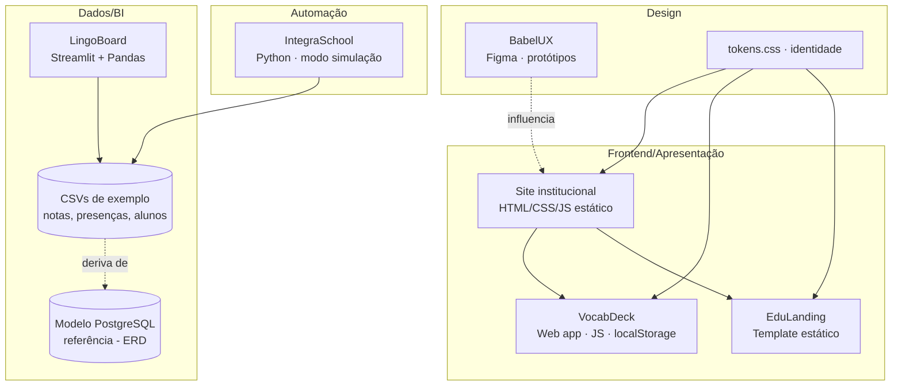
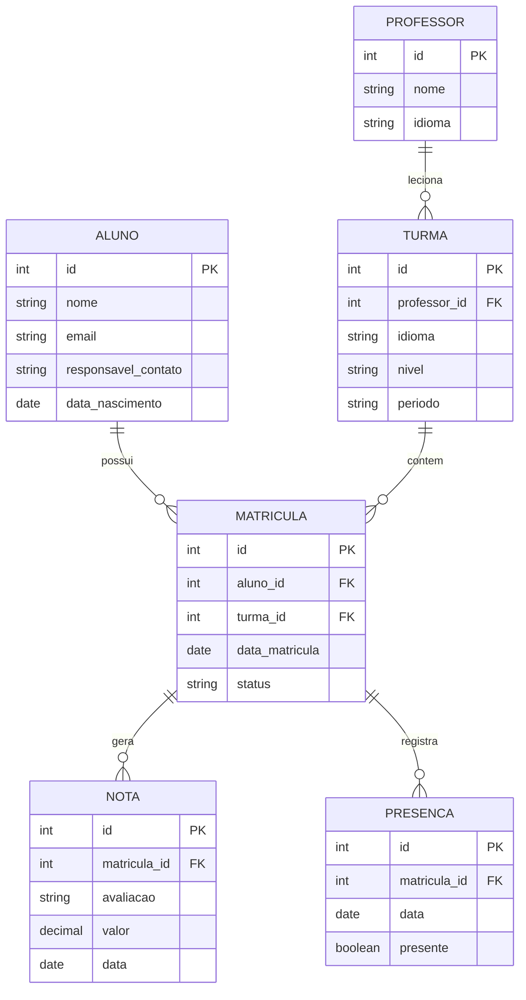

# TDD — Arquitetura BabelStack Júnior (plataforma + 5 produtos)

| Campo | Valor |
| --- | --- |
| Tech Lead | Roger Quinelato (CTO) |
| Product | Raquel Pereira (CPO) |
| Equipe | Roger, Raquel (dupla autorizada) |
| Epic/Board | Jira projeto **EST** — EstagioEmpresarialII |
| Design | Figma `BwHP5UWR51JXmtGOW9cfS1` |
| Status | Draft |
| Criado | 2026-06-30 |
| Atualizado | 2026-06-30 |

## Contexto

A BabelStack Júnior é uma Empresa Júnior fictícia de EdTech cujo portfólio reúne **5 produtos** que cobrem BI, web, UX/UI e automação, voltados a escolas de idiomas (privadas e CILs públicas) e professores. Este TDD documenta a **arquitetura técnica comum** e a de cada produto, servindo de base para a Seção 16 (Tecnologia e Inovação) do documento acadêmico e de guia para o build nas Semanas 4–5.

**Domínio:** educação / gestão escolar de idiomas. **Stakeholders:** gestores e professores (usuários), dupla executora, banca avaliadora.

**Princípio norteador:** stack **open-source / custo-zero**, com produtos pequenos e demonstráveis (MVPs) que rodam de forma independente, mas compartilham um **modelo de dados** e a **identidade visual** comuns.

## Definição do Problema e Motivação

- **Gestão escolar baseada em planilhas dispersas** → decisões lentas sobre evasão/desempenho (resolvido por LingoBoard).
- **Estudo passivo e sem ferramenta de revisão de baixo custo** → baixa retenção (VocabDeck).
- **Ausência de presença digital** em escolas públicas → eventos mal divulgados (EduLanding).
- **Interfaces educacionais defasadas** → alta carga cognitiva (BabelUX).
- **Tempo perdido com rotinas administrativas manuais** (IntegraSchool).

**Por que agora:** entregáveis exigidos pelas diretrizes (5 produtos + site) com prazo em 31/07/2026.

## Escopo

### ✅ Em escopo (MVPs acadêmicos)
- 5 produtos demonstráveis (ver PRDs em `docs/produtos/prd_*.md`).
- Site institucional estático que apresenta empresa + portfólio.
- **Modelo de dados PostgreSQL** de referência (ERD) — base conceitual do domínio escolar.
- Dados de exemplo (CSV) para demonstração.

### ❌ Fora de escopo (nesta entrega)
- Banco PostgreSQL em produção com dados reais (ERD é referência; MVPs usam CSV/localStorage).
- Autenticação/multiusuário, pagamentos, integrações externas reais.
- Apps nativos mobile; CI/CD; alta disponibilidade.

### 🔮 Futuro (pós-curso) [estimativa]
- Persistência real em PostgreSQL e contas de usuário.
- Análise preditiva de evasão (LingoBoard).
- Envio real de mensagens (IntegraSchool).

## Solução Técnica

### Visão de arquitetura

Cada produto é **autônomo** e roda isolado; o que os une é o **domínio de dados** (modelo escolar) e os **tokens de identidade**. Não há backend monolítico — é um portfólio de soluções leves.

### Modelo de dados (ERD PostgreSQL) — referência

Modela o domínio escolar de idiomas. É a **base conceitual** que origina os CSVs de exemplo do LingoBoard/IntegraSchool e fecha o bônus da Seção 16.

**Entidades:**
- **ALUNO** — dados do estudante (contato do responsável fictício, por privacidade).
- **PROFESSOR** — docente responsável por turmas.
- **TURMA** — idioma + nível + período, ligada a um professor.
- **MATRICULA** — vínculo aluno↔turma (resolve o N:N) e âncora de notas/presenças.
- **NOTA** — avaliações por matrícula.
- **PRESENCA** — chamada por matrícula (base do indicador de frequência/evasão do LingoBoard).

### Componentes por produto
- **LingoBoard:** `app.py` (Streamlit) lê CSV (derivado do ERD) → Pandas calcula métricas → gráficos + tabela de risco. Sem persistência.
- **VocabDeck:** SPA estática; motor de Leitner em JS; estado em `localStorage`. Sem servidor.
- **EduLanding:** template estático com pontos de conteúdo editáveis; exemplo "Feira Cultural de Idiomas".
- **BabelUX:** entregável de design (Figma) — diagnóstico heurístico + protótipo "Antes/Depois". Não há código.
- **IntegraSchool:** `integraschool.py` lê CSV de alunos → gera resumos/lembretes (modo simulação, saída em arquivo) + organiza pastas.
- **Site institucional:** páginas estáticas (empresa, portfólio, contato) consumindo os tokens de identidade.

### Stack e deploy
- **Linguagens/ferramentas:** Python (Streamlit, Pandas), HTML/CSS/JS, PostgreSQL (referência), Figma.
- **Deploy:** estáticos via GitHub Pages [estimativa]; LingoBoard local ou Streamlit Community Cloud [estimativa]; IntegraSchool por linha de comando.
- **Gestão:** Kanban (Trello/Notion) + Jira (projeto EST) para o backlog deste pacote.

## Riscos

| Risco | Impacto | Probab. | Mitigação |
| --- | --- | --- | --- |
| Tempo curto (5 semanas p/ 5 produtos + site) | Alto | Alta | Priorizar MVPs P0; sprints enxutas; escopo "fora do v1" explícito |
| Produtos ficarem só em stub | Alto | Média | Definição de pronto por produto; demonstrável > completo |
| Falta de dados realistas p/ demonstrar | Médio | Média | CSVs de exemplo derivados do ERD |
| Anexos visuais atrasados (ERD, Gantt, fluxograma) | Médio | Média | Produzir cedo (Semana 3) e referenciar nas seções |
| Dupla (2 pessoas) sobrecarregada | Médio | Alta | Dividir por trilha (Roger=técnico, Raquel=produto/design) |
| Privacidade de dados de alunos | Baixo | Baixa | Somente dados fictícios; IntegraSchool em modo simulação |

## Plano de Implementação

| Fase | Tarefa | Responsável | Estimativa |
| --- | --- | --- | --- |
| Sprint 1 | ERD + fluxograma + esqueleto do site | Roger | 3d [estimativa] |
| Sprint 2 | LingoBoard (P0) + VocabDeck (P0) + site publicado | Roger/Raquel | 5d [estimativa] |
| Sprint 3 | EduLanding + IntegraSchool + BabelUX (Figma) + Gantt | Roger/Raquel | 5d [estimativa] |
| Sprint 4 | Mockups/prints, documento 20+ pág, ensaio | Dupla | 4d [estimativa] |
| Sprint 5 | Ajustes pós-feedback, entrega final | Dupla | 3d [estimativa] |

Caminho crítico: ERD/modelo → CSVs → LingoBoard/IntegraSchool.

## Estratégia de Testes
- **Manual/demonstração:** cada produto tem um roteiro de demo (happy path) validado antes da apresentação.
- **Dados:** validar leitura dos CSVs de exemplo (campos obrigatórios, linhas inválidas tratadas).
- **Responsividade:** VocabDeck, EduLanding e site testados em desktop e mobile.
- **Critério de pronto:** o produto roda do zero com os dados de exemplo, sem erro, e cobre os requisitos P0 do respectivo PRD.

## Dependências
- Identidade visual (`assets/identidade/tokens.css`) — ✅ pronta.
- ERD/modelo de dados — este documento (base dos CSVs).
- Conta GitHub (deploy) e Figma — ✅ disponíveis.

## Questões em Aberto
| # | Questão | Dono | Status |
| --- | --- | --- | --- |
| 1 | LingoBoard publica (Streamlit Cloud) ou roda local na banca? | Roger | 🔴 Aberto |
| 2 | EduLanding e site compartilham o mesmo tema/base? | Raquel | 🟡 Em discussão |
| 3 | Escopo do estudo de caso BabelUX (qual interface-alvo)? | Raquel | 🔴 Aberto |

## Roadmap
Ver `docs/produtos/roadmap.md` (alinhado às Sprints 1–5 + visão pós-curso).
