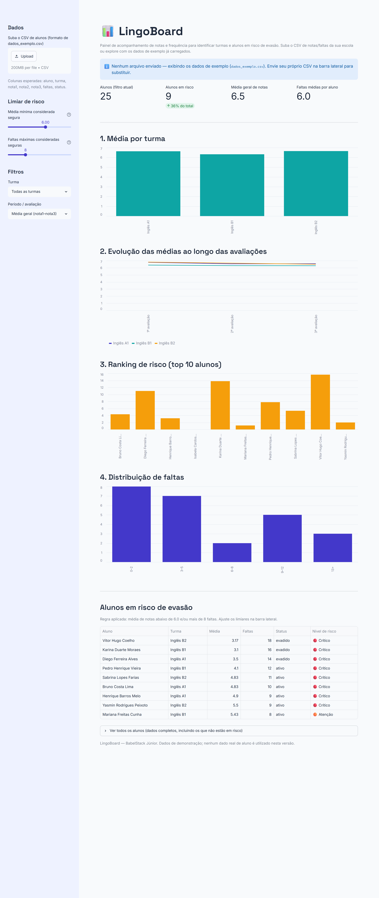
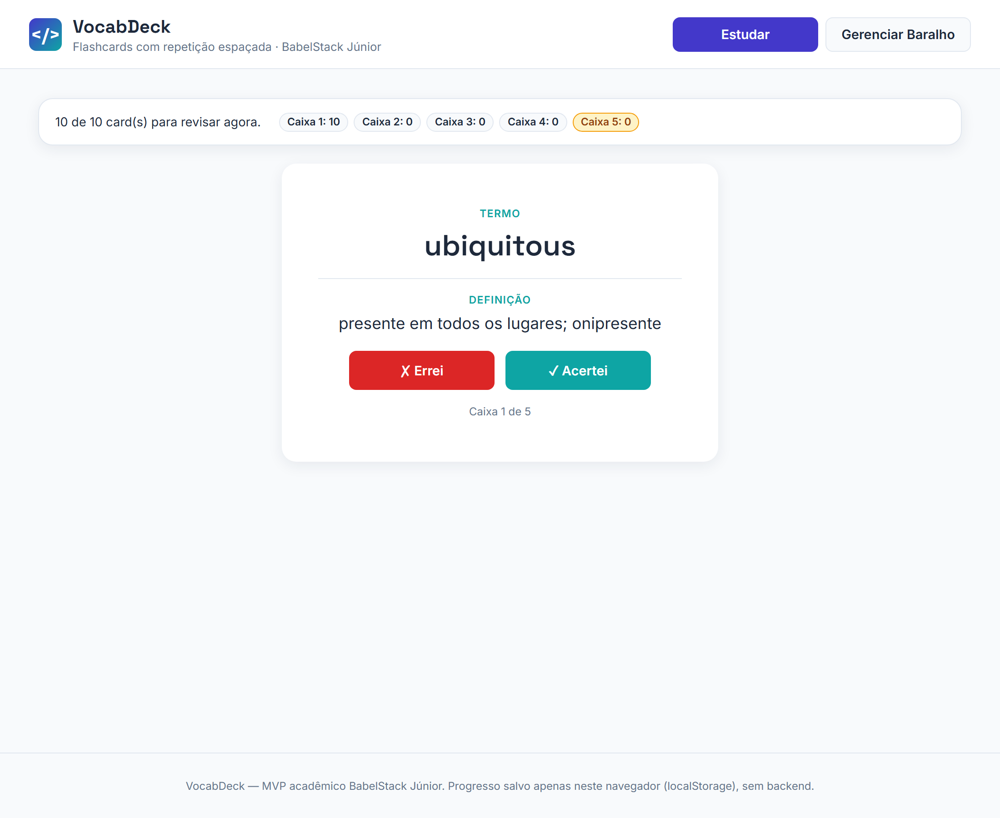
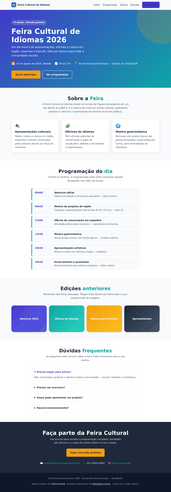
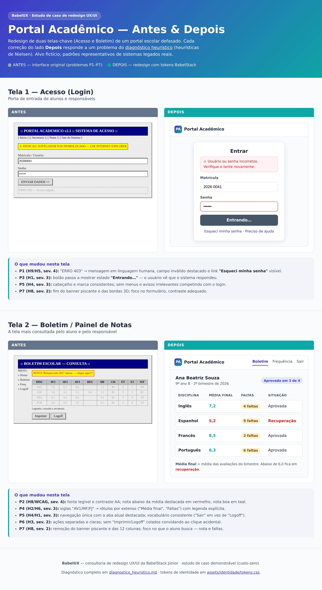
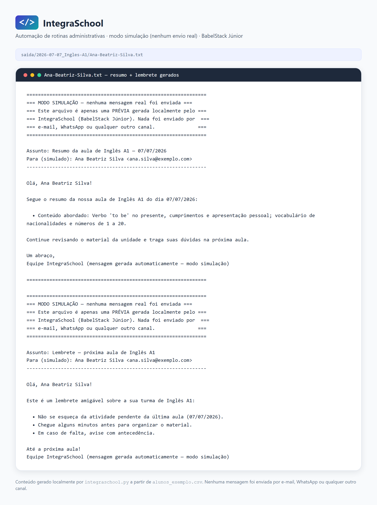

# 8. Portfólio de Produtos e Serviços

O portfólio reúne cinco produtos distintos, cobrindo Business Intelligence, desenvolvimento web, UX/UI e automação. Os valores referem-se ao setor privado; para escolas públicas, os serviços são gratuitos (projeto social).

| # | Produto | Categoria | Valor estimado (privado) |
| --- | --- | --- | --- |
| 1 | LingoBoard | Dashboards educacionais (BI) | R$ 800–2.000 [estimativa] |
| 2 | VocabDeck | Plataforma web de flashcards | R$ 1.500–3.000 [estimativa] |
| 3 | EduLanding | Criação de páginas/sites educacionais | R$ 600–1.800 [estimativa] |
| 4 | BabelUX | Consultoria de redesign UX/UI | R$ 500–1.500 [estimativa] |
| 5 | IntegraSchool | Automação de rotinas administrativas | R$ 700–2.000 [estimativa] |

## 1. LingoBoard — Dashboards educacionais (BI)

- **Descrição:** painel interativo em Python (Streamlit/Pandas) que transforma planilhas de notas e chamadas em gráficos dinâmicos.
- **Público-alvo:** escolas de idiomas privadas e públicas (CILs).
- **Problema que resolve:** dificuldade dos gestores em identificar padrões de evasão e baixo desempenho de forma ágil.
- **Benefícios:** decisão baseada em dados, identificação rápida de alunos em risco e modernização da gestão.

_LingoBoard — dashboard com os 4 gráficos (média por turma, evolução por avaliação, ranking de risco e distribuição de faltas) e a tabela de alunos em risco._

## 2. VocabDeck — Plataforma web de flashcards

- **Descrição:** aplicação web responsiva para revisão espaçada de vocabulário (caixas de Leitner), com arquitetura preparada para múltiplos idiomas.
- **Público-alvo:** professores particulares de idiomas e infoprodutores.
- **Problema que resolve:** passividade do aluno no estudo fora da sala e falta de ferramentas gamificadas de baixo custo.
- **Benefícios:** aumento da retenção de vocabulário por metodologias ativas e gamificação.

_VocabDeck — tela de estudo do baralho, com o card revelado e o motor de revisão espaçada (Leitner) de 5 caixas._

## 3. EduLanding — Criação de páginas/sites educacionais

- **Descrição:** template de landing page educacional reutilizável em HTML/CSS/JS, responsivo (ex.: "Feira Cultural de Idiomas").
- **Público-alvo:** escolas públicas e projetos de línguas que precisam de presença web.
- **Problema que resolve:** ausência de páginas próprias para eventos, simulados e materiais didáticos.
- **Benefícios:** presença digital de baixo custo, responsiva e fácil de editar pela própria escola.

_EduLanding — landing page responsiva do exemplo "Feira Cultural de Idiomas" (hero, sobre, programação, galeria, FAQ e CTA)._

## 4. BabelUX — Consultoria de redesign UX/UI

- **Descrição:** redesenho da usabilidade de portais educacionais existentes, com entregáveis "antes/depois" em alta fidelidade no Figma.
- **Público-alvo:** escolas e professores com sistemas defasados.
- **Problema que resolve:** interfaces confusas que frustram os alunos e elevam a carga cognitiva.
- **Benefícios:** ambiente de estudo mais acessível, intuitivo e agradável.

_BabelUX — comparativo Antes/Depois do Portal Acadêmico (telas de Login e Boletim), aplicando os tokens de identidade da marca._

## 5. IntegraSchool — Automação de rotinas administrativas

- **Descrição:** scripts em Python (modo simulação) que automatizam envio de resumos de aula e lembretes, e organizam arquivos.
- **Público-alvo:** professores de idiomas com processos manuais.
- **Problema que resolve:** tempo perdido com tarefas administrativas repetitivas.
- **Benefícios:** ganho de horas semanais e padronização da comunicação com alunos/responsáveis.

_IntegraSchool — prévia formatada de um resumo e um lembrete gerados em modo simulação (conteúdo real da saída do script)._
